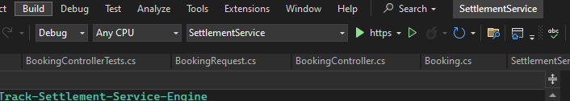
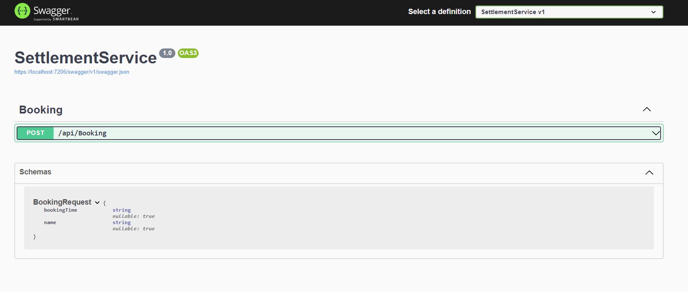
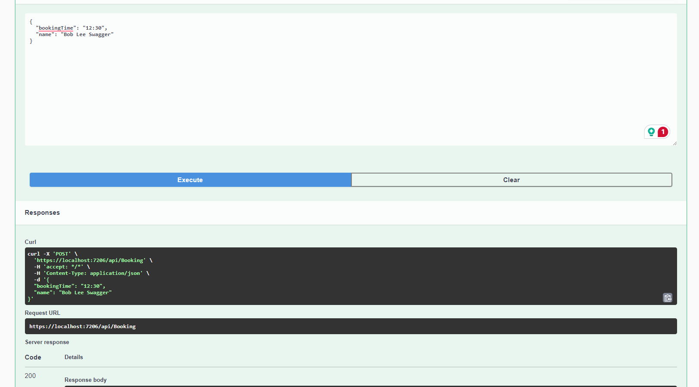
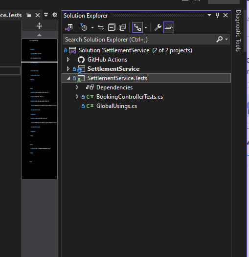

# VinhNgo-InfoTrack-Settlement-Service-Engine

Welcome to InfoTrack Settlement Service Engine.

This project is the attempt of Vinh Ngo in InfoTrack Coding Challenge.

It is an ASP.NET 8.0 application that uses REST API to accept booking reservations.
It also comes with React GUI application [InfoTrack Settlement Service UI](https://github.com/vinhngogia0906/VinhNgo-InfoTrack-SettlementService/tree/main/settlement-service-ui).

## Prerequisites

In order to start the project, you will need to install these software and tool:
- [.NET SDK and Runtime](https://dotnet.microsoft.com/en-us/download/dotnet/8.0) - This is required to build the backend application.
- [Visual Studio](https://visualstudio.microsoft.com/thank-you-downloading-visual-studio/?sku=Community&channel=Release&version=VS2022&source=VSLandingPage&cid=2030&passive=false) - Recommended IDE

## Getting Started
This is how you setup and run the project locally on your enviroment.

1. Open the solution file of the `SettlementService` folder inside the cloned [repository](https://github.com/vinhngogia0906/VinhNgo-InfoTrack-SettlementService) with Visual Studio
2. Build the solution with the Visual Studio's Build tool.
3. Start the project in debug mode. The application is configured to run with Docker container. However, for the sake of simplicity, I recommend running with the configuration like the below screenshot.

4. A browser tab will be open and you will see the Swagger playground GUI where you can examine the schema and all the API Documentation.

5. You can test the APIs with the Swagger playground like this:

6. You can also test the settlement service with the [InfoTrack Settlement Service UI](https://github.com/vinhngogia0906/VinhNgo-InfoTrack-SettlementService/tree/main/settlement-service-ui) for the most complete experience. Make sure you note down the backend booking api endpoint and follow the GUI application's instruction to put it in the right place.In this case it is `https://localhost:7206/api/Booking` but it might be different when you start debugging in your environment.
7. You can also run the unit tests with the dependency [InfoTrack Settlement Service Test project](https://github.com/vinhngogia0906/VinhNgo-InfoTrack-SettlementService/tree/main/SettlementService.Tests) in the same solution.

8. Otherwise, you can see the testing results via the [Git Action](https://github.com/vinhngogia0906/VinhNgo-InfoTrack-SettlementService/actions).