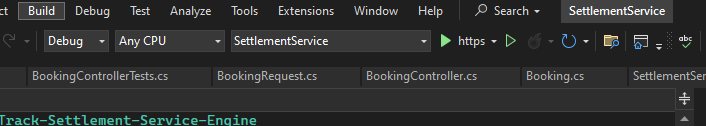
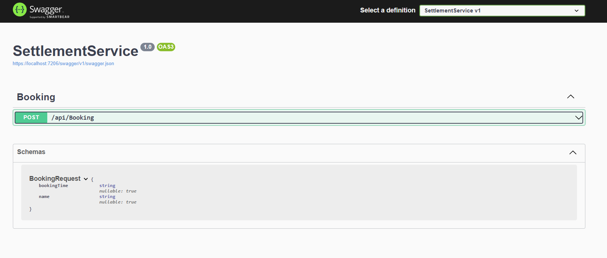
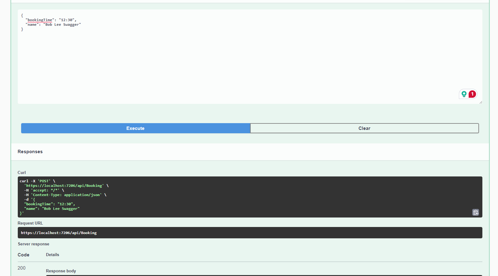
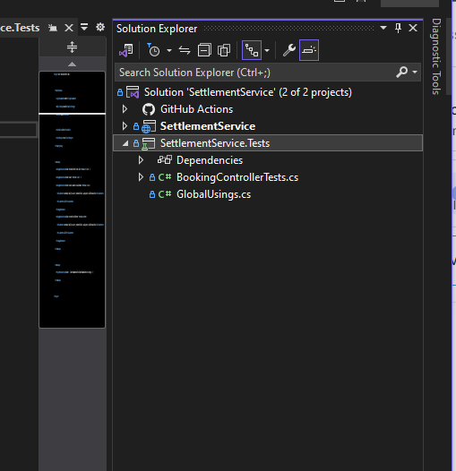

# Settlement Service Engine (Backend)

An ASP.NET 8.0 REST API that manages settlement booking reservations.

## Business Rules

- Bookings are accepted in `HH:mm` format during business hours (09:00--17:00)
- Maximum 4 simultaneous bookings per time slot
- Each booking returns a unique GUID identifier

## Prerequisites

- [.NET 8.0 SDK and Runtime](https://dotnet.microsoft.com/en-us/download/dotnet/8.0)
- [Visual Studio 2022](https://visualstudio.microsoft.com/) (recommended)

## Getting Started

1. Open the solution file from the `SettlementService` folder in Visual Studio.
2. Build the solution.
3. Start in debug mode (select **Any CPU / https** for simplicity).
   
4. Swagger UI opens in the browser for API exploration and testing.
   

## API

### POST `/api/Booking`

Request body:
```json
{
  "bookingTime": "09:00",
  "name": "John Smith"
}
```

Returns `200 OK` with `{ "bookingId": "<guid>" }` on success.



## Companion Projects

- [Settlement Service UI](../settlement-service-ui) -- React frontend
- [Settlement Service Tests](../SettlementService.Tests) -- xUnit tests, also run by GitHub Actions CI


