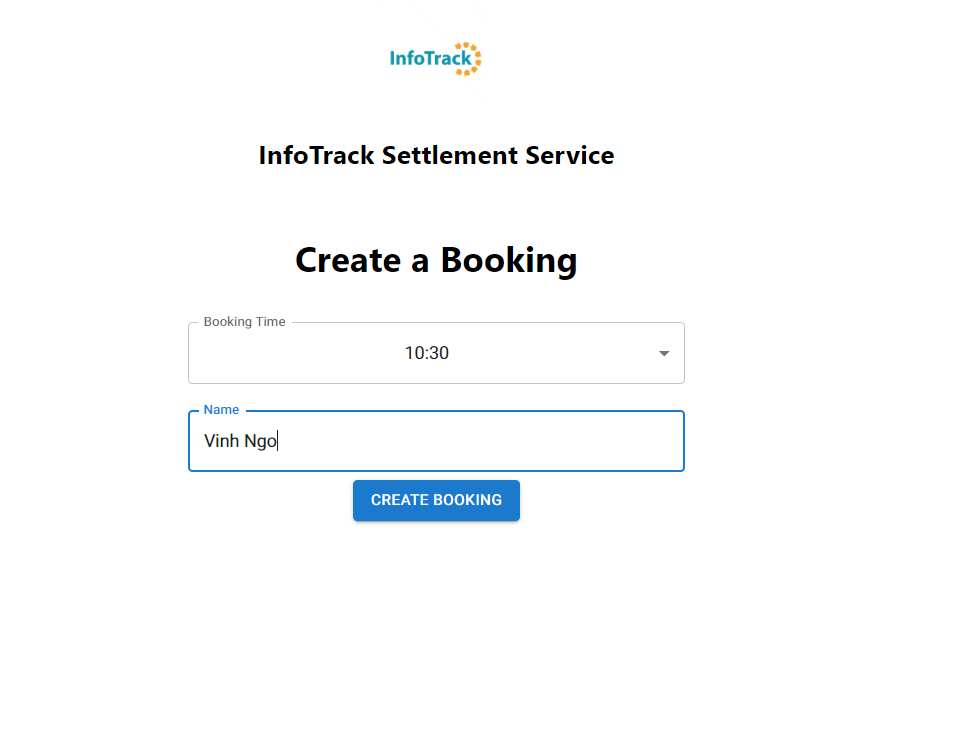
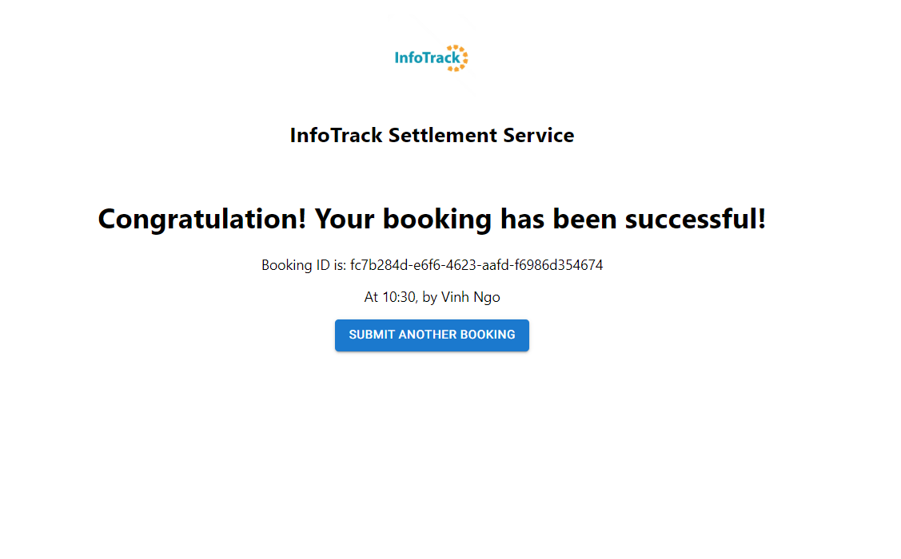
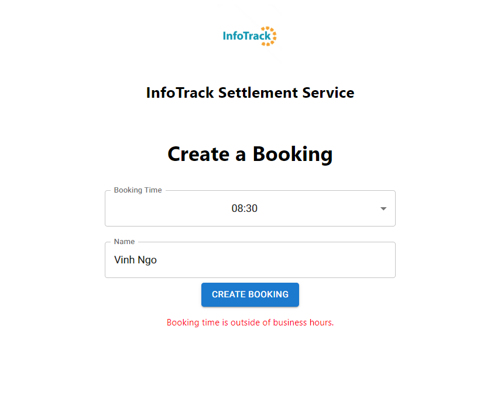

# Settlement Service UI (Frontend)

A React 18 TypeScript application that provides a booking interface for the [Settlement Service Engine](../SettlementService) backend.

## Prerequisites

- [Node.js](https://nodejs.org/en/download) v20.16.0+
- [npm](https://docs.npmjs.com/downloading-and-installing-node-js-and-npm) v10.8.2+
- [Visual Studio Code](https://code.visualstudio.com/download) (recommended)

## Getting Started

1. Open the `settlement-service-ui` folder in VS Code.
2. Install dependencies:
   ```
   npm install
   ```
3. Start the [Settlement Service Engine](../SettlementService) backend and note its API endpoint.
4. Update the endpoint in `.env` if it differs from the default (`https://localhost:7206/api/Booking`).
5. Start the dev server:
   ```
   npm start
   ```
6. Open `http://localhost:3000/`.

## Usage

Select a time slot, enter a name, and submit the booking. On success, the app displays the booking ID and details.





## Scripts

| Command | Description |
|---------|-------------|
| `npm start` | Start the dev server |
| `npm test` | Run tests in watch mode |
| `npm run build` | Build for production |
